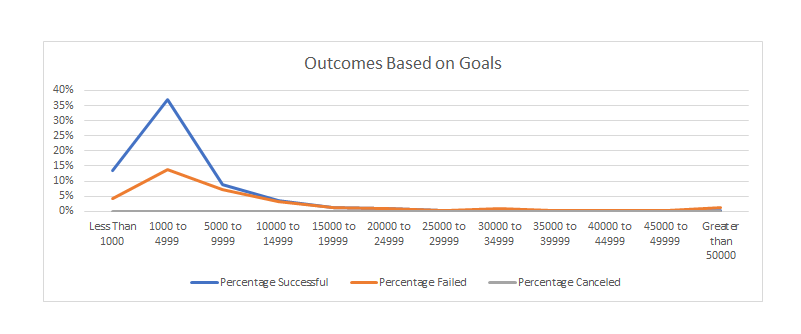

# Module 1 Challenge
## Objectives:
Louise’s play "Fever" came close came close to its fundraising goal in a short amount of time. How many other Kickstarter campaigns were able to do this as well?

## Assumptions:
* "Fever"
* ID: 3937 / Category: Theater / Subcategory: Plays / Date: 6/13/2016 / Country: US
* Goal: $2,885.00 / Pledged: $2,485.00
* Outcome: Failed

## Findings:
### 1. Louise's play, "Fever", measured against plays' outcome based on fundraising goals
By analyzing the graph of generated from outcomes based on goals, we can see that success  and failure percentages are much higher when the plays' goals are around $1000 to $4999 dollars. Success percentages are around 37%, being 25% higher than the failure rate, which is around 14%. As we can see that this is a right skewed graph, any goal above $10000 tends to have a <5% rate of success in outcome.

Placing Louise's play "Fever" into this graph, we can see that the play was within the range of $1000 to $4999 dollars, which had high rates of success. While the play was pledged $2,485.00, it still failed to reach the goal of $2,885.00. We have to keep in mind that while success rates are much higher on the lower range of goals, failure rates are also high. This meant that man of the low goal play fundraisers were successful in fundraising, but some were also met with failure. Wihtin "Fever"'s goal category, 388 plays were successful, 146 failed, and 0 were canceled. This meant that 73% of the 534 plays were successful at fundraising and 27% failed.

### 2. Louise's play, "Fever", measured against plays' descriptive statistics
Placing Louise's play "Fever" within descriptive statistics derived from plays dataset, we can see that her goal of $2,885.00 is within 1 standard deviation of both failed and success ranges.
(Successful mean: $4,101, Stdev: $7,285 / Failed mean: $9,827, Stdev: $21,855)

Using the IQR outlier formula, we can see that "Fever" was also not an outlier and existed well within the bounds of Q1 and Q3 for both successful and failed outcomes.
(Outlier: Successful Lower bound: $(4,250) Upper bound $9,750 / Failed Lower bound: $(3,000) Upper bound $9,000)

In other words, the success and failure of meeting the play's target goal was not due to the goal amount, but instead other reasons.

### 3. Louise's play, "Fever", measured against count of outcomes based on launch data in Theater sample
Looking at the count of outcomes based on launch date, it is clear that the number of successful theater fundraisers are much higher during the period of 2013 - 2017, peaking at 2015. Similarly, failed theater fundraisers also increased between the same period with a difference of 100 fundraisers with successful theater fundraisers. That said, it seems that data of canceled and failed data did not exist before 2013, as there are only low numbers of successful theater fundraisers recorded each year from 2010 - 2013l where fewer than 10 theater fundraisers were successful annually.

Louise's play, Fever, comes at June of 2016, which exists within the period of increased fundraiser success and failure rates. In other words, the probability of reaching the goal should have been high. Out of a total of ~410 theater fundraisers, there were ~250 successful theater fundraisers, ~150 failed theater fundraisers, and ~10 canceled theater fundraisers.

### 4. Louise's play, "Fever", measured against the sum of goals based on launch data in Theater sample
Within the graph, the sum of goals based on launch date, it seems that recorded activities for theater fundraisers also increased during the period of 2013 - 2017. Interestingly, between 2014 - 2015 there were a huge spike in canceled fundraisers that were high in goal (~$30 million). This perhaps, was due to initial hype surrounding theaters as a fundraiser, where investors wanted to target high goals for theater fundraising, but then quickly canceled the idea. With this notion in mind, it also explains the subsequent high level of failed theater fundraisers in 2015, where fundraisers around $15 million dollars failed. Perhaps, fundraisers thought 30 million was too high, which then caused them to cancel the fundraiser. And then subsequent fundraisers attempted to follow through with only half of goal cap, but then failed. It is evident that successful fundraisers are all at very low amounts throughout all periods of time.

More importantly, Louise's play, "Fever", is not affected by this theater fundraiser's bubble, where there was large goal in mind. Since the play's goal was $2,885, it was well within the mean of successful theater fundraisers, and her timing was within when many theaters were successfully fundraising.

## Conclusion:
All in all, from examining the data, it is clear that that theater fundraiser had a bubble between 2013 - 2016. This meant that successful theater fundraisers largely increased with corresponding failure rate; perhaps due to theater quality. The height of this bubble was during 2015, when many of the high goal fundraisers canceled / failed.

That said, most successful plays were around a mean of $4,101 with a standard deviation of $7,285. Louise's goal of $2,885.00 was well within that range, and her timing was also near mid/end of fundraisers, which meant that she came into a maturing and stablizing market; it is clear that Louise's play was well within the IQR range of those which were successful and was not an outlier in its goal cap. In other words, the goal and timing of Louise's play was not the reason why the fundraiser failed and it is probably because of other reasons.

## Notes:
* The existing source data does not have data on failed and canceled kickstarters before 2014. This means that an unedited Pivot Line Chart will have canceled and failed lines floating in middle of the chart. To avoid this problem, the table's "hidden data settings" has been enabled, where empty cells are calculated as zeros.
* Note that Countifs within Outcomes Based on Goals existing does not include "Plays" as part of its conditions. This is due to the fact that my excel becomes unstable with too many conditions, in which generates "Too Many Arguments" warning. Therefore, a new data set was ported from the source dataset called "Plays Total Data".
*In order to derive the median, mode, Q1, Q3, and IQR of the Plays Data Set, the data needed to be ported out and placed into new tabs. This is because, while Excel have conditional means, or =averageif, the program does not have other conditional formulas for data analysis.
* Since there are no cancellation rates in the plays data, an additional tab was not created for the dataset.

### Challenge

#### Chart 1: Outcomes Based on goals

Graph utlizied in Findings 1

#### Chart 2: Play Data Set Descriptive Statistics

Graph utlizied in Findings 2

#### Chart 3: Outcomes Base on Launch date  (Base on count of outcomes)

Graph utlizied in Findings 3

#### Chart 4: Outcomes Base on Launch date  (Base on sum of goal)
Graph utlizied in Findings 4
